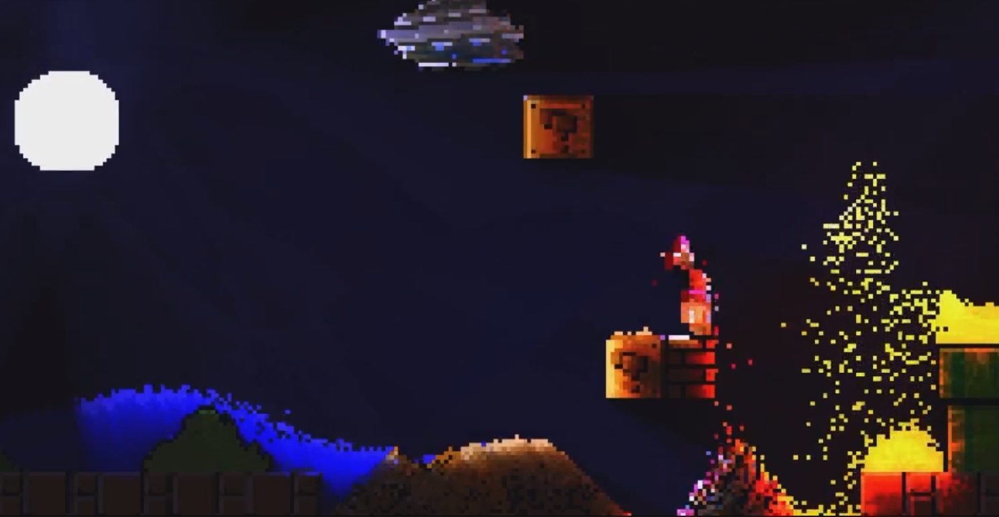

# Falling Sand Simulator
A pixel-based physics and rendering engine written using C++ and OpenGL, as a part of Graphics Programming course at SNU ECE.

This project is heavily inspired by Noita and The Powder Toy.

The included video (Demo_Video.mp4) contains some flashy demo of the program. (Caution: Program not actually as exciting as the video.)

---

## Usage Instruction

Falling Sand.zip includes a pre-built binary for Windows.

If you are on Linux, please install libglm-dev, libglfw3-dev, and libfreetype-dev and use CMake to compile.

If you are on Windows, use the included libraries under lib and dlls.

Instructions for the program will be displayed in the top left corner of the program.

Have fun!

